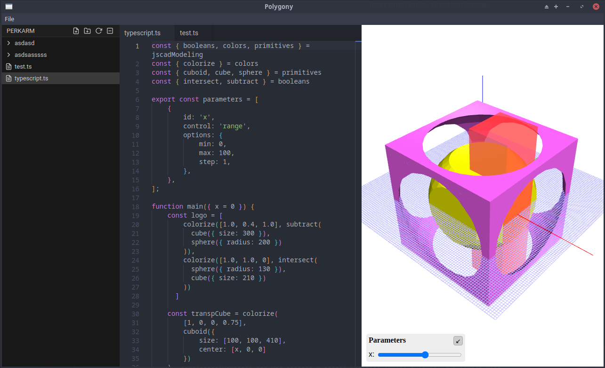

### Work in progress

# Polygony

Polygony - software for creating solid 3D CAD models using JavaScript (JSCAD library)



## Features

:heavy_check_mark: Modules support  
:heavy_check_mark: File preview  
:heavy_check_mark: Rich Monaco editor  
:heavy_check_mark: File explorer

## MVP Roadmap

- [ ] Preview
    - [ ] Save camera state
    - [ ] Parameters
- [ ] Editor
    - [ ] Tabs
    - [ ] Autocomplete
- [ ] File explorer
    - [ ] Rename
    - [ ] Delete
    - [ ] Copy/paste
    - [ ] Move
    - [ ] Export
- [ ] Other
    - [ ] App icon
    - [ ] DX
    - [ ] Autoupdate

## Development

```bash
npm install
npm run watch
```

`packages` folder contains electron code
- `packages/main` - code for main electron process
- `packages/renderer` - code for renderer electron process
- `packages/preload` - code for bridge between main and renderer

## License

Polygony is released under the MIT licence.
